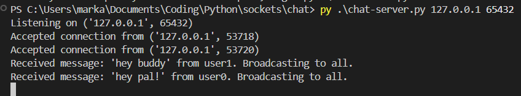
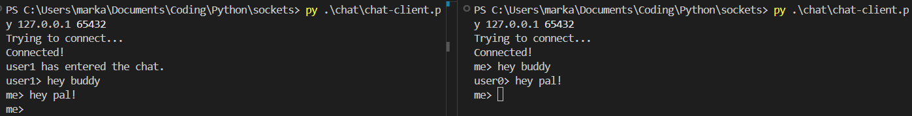

# Terminal chat
A simple chat program that allows multiple clients to talk to each other.

## Usage
First, clone this repo locally. Then in one terminal run the server with a specified host and port. For example, for localhost, run `py chat-server.py 127.0.0.1 65432`. Then, set up as many* clients (chat users) as you want from other terminals with `py chat-client.py 127.0.0.1 65432`, and get chatting! Any client can leave the chat by typing 'end'.

\* I haven't actually tested this so it will probably break at some point.